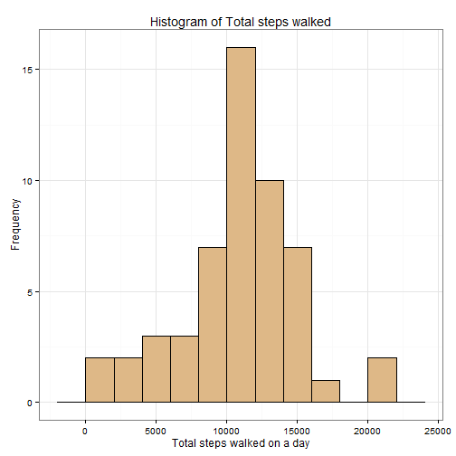
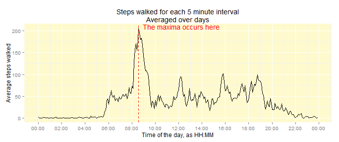
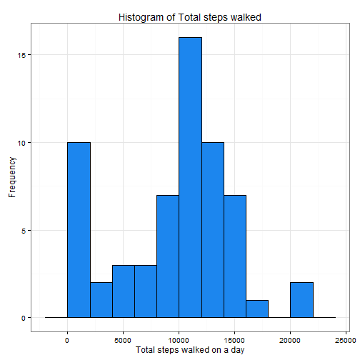

***
## Background 

This project makes use of data from a personal activity monitoring device. The device collects data at 5 minute intervals through out the day. The data consists of two months of data from an anonymous individual collected during the months of October and November, 2012 and include the number of steps taken in 5 minute intervals each day.

***
## About the Data

The data for can be downloaded from [here](https://d396qusza40orc.cloudfront.net/repdata%2Fdata%2Factivity.zip)

The variables included in this dataset are:
  
  1. steps: Number of steps taking in a 5-minute interval (missing values are coded as NA)
  2. date: The date on which the measurement was taken in YYYY-MM-DD format, total 61 days
  3. interval: Identifier for the 5-minute interval in which measurement was taken

The dataset is stored in a comma-separated value (CSV) formatted file and there are a total of 17,568 observations in this dataset.

***
## Loading and preprocessing the data


```r
url = 'https://d396qusza40orc.cloudfront.net/repdata%2Fdata%2Factivity.zip'
download.file(url, 'activity.zip')
fname = unzip('activity.zip', list = T)$Name
activity = read.csv(fname, stringsAsFactors = F)
options(max.print = 100, scipen = 999)
```


***
## Central measure of total number of steps taken per day


```r
daily = activity %>% 
  group_by(date) %>% 
  filter(!is.na(steps)) %>% 
  summarize(Total.Steps = sum(steps)) %>% 
  as.data.frame()
```

#### Distribution of total number of steps walked on daily basis


```r
ggplot(daily, aes(x = Total.Steps)) + 
  geom_histogram(fill = 'burlywood', col = 'black', binwidth = 2000) + 
  theme_bw() + ggtitle('Histogram of Total steps walked') + 
  xlab('Total steps walked on a day') + ylab('Frequency')
```

 

#### Total steps walked on daily basis has 

  *  Average of __10766__ 
  *  Median of  __10765__

***
## Average daily activity pattern


```r
tdata = activity %>% 
  group_by(interval) %>% 
  summarize(Avg.Steps = mean(steps, na.rm = T)) %>% 
  mutate(hours = as.POSIXct(strptime(sprintf("%04d", interval), "%H%M")))

p = tdata %>% 
  ggplot(aes(x = hours, y = Avg.Steps)) + 
  geom_line(color = 'black') + guides(color = F) + 
  scale_x_datetime(breaks = date_breaks("2 hour"), 
                   labels = date_format("%H:%M")) + 
  geom_vline(aes(xintercept = as.numeric(hours[which.max(Avg.Steps)])), 
             colour = 'red', linetype = 8) + 
  theme(panel.background = element_rect(fill = 'lemonchiffon')) + 
  ggtitle('Steps walked for each 5 minute interval\nAveraged over days') + 
  xlab('Time of the day, as HH:MM') + ylab('Average steps walked') 

loc = tdata$interval[which.max(tdata$Avg.Steps)]
loc = (floor(loc/100)*3600+(loc-100*floor(loc/100))*60)*1.1

p + annotate("text", as.POSIXct(loc, origin = Sys.Date()-0.25), y = Inf, hjust = 0,
             vjust = 1, label = "The maxima occurs here", col = 'red')
```

 

#### The 5-min interval that has the maximum number of steps on average across all the days, starts from


```r
paste0(substr(tmax,1,2),":",substr(tmax,3,4))
```

```
[1] "08:35"
```

***
## Imputing missing values

#### Total number of missing values in the dataset 2304

#### Filling in the missing values in the dataset with the median for the corresponding 5-minute interval


```r
fdata = ddply(activity, 
              .(interval), 
              transform, 
              steps = ifelse(is.na(steps), median(steps, na.rm = T), steps))
fdata = as.data.frame(fdata)
# fdata is the dataset with the missing values filled
```

#### Total steps walked for each day


```r
fdaily = fdata %>% 
  group_by(date) %>% 
  summarize(Total.Steps = sum(steps)) %>% 
  as.data.frame
```

## Distribution of total steps taken each day, of the missing values filled dataset

```r
ggplot(fdaily, aes(date)) + 
  geom_histogram(aes(Total.Steps), stat = 'bin', 
                 fill = 'firebrick1', color = 'white') + 
  theme_bw() + ylab('Daily total steps taken') + xlab('5min periods')
```

 

#### Total steps walked on daily basis has 

  *  Average of __9504__ 
  *  Median of  __10395__


With missing values imputed the mean and median for the dataset comes down or in another words, with missing values, mean/median gets over-estimated.

***
## Differences in activity patterns between weekdays and weekends?

#### Creating a separate variable for indicating weekday/weekends


```r
fdata.ts = fdata
fdata.ts[ ,2] = as.POSIXct(strptime(x = fdata.ts[ ,2], format = "%Y-%m-%d"))
fdata.ts$wday = weekdays(fdata.ts[ ,2])

fdata.ts$wdayflag = 'Weekday'
fdata.ts[(fdata.ts$wday=="Sunday")|(fdata.ts$wday=="Saturday"), 5] = 'Weekend'
fdata.ts$wdayflag = factor(fdata.ts$wdayflag)
fdata.ts = fdata.ts[ ,-4]
```

#### Average steps walked for each 5-minute interval weekday/weekends wise 


```r
fweekday = fdata.ts %>% 
  group_by(interval, wdayflag) %>% 
  summarize(AvgSteps = mean(steps)) %>% 
  as.data.frame
```

Plot of average steps walked for each 5-minute interval being split over weekdays vs weekends


```r
fweekday$hours = as.POSIXct(strptime(sprintf("%04d",fweekday$interval), '%H%M'))
fweekday$hours = as.numeric(fweekday$hours - trunc(fweekday$hours, "days"))
class(fweekday$hours) = "POSIXct"

ggplot(fweekday, aes(x = hours, y = AvgSteps, color = wdayflag)) + 
  geom_line() + 
  theme_bw() + 
  scale_x_datetime(breaks = date_breaks("2 hour"), 
                   labels = date_format("%H:%M")) +
  guides(color = FALSE) + 
  stat_smooth(method = "glm") + 
  ggtitle(label = "Weekdays vs Weekends\nMore daywide activity on weekends") + 
  facet_wrap(~wdayflag, nrow = 2)
```

 

We can see from the figures above that there is a distinct difference between the activity spread between weekdays and Weekends. The activity on weekends are more spread thoughout the day. Also Slightly uptrend is visible as the day progresses on weekends.

***
